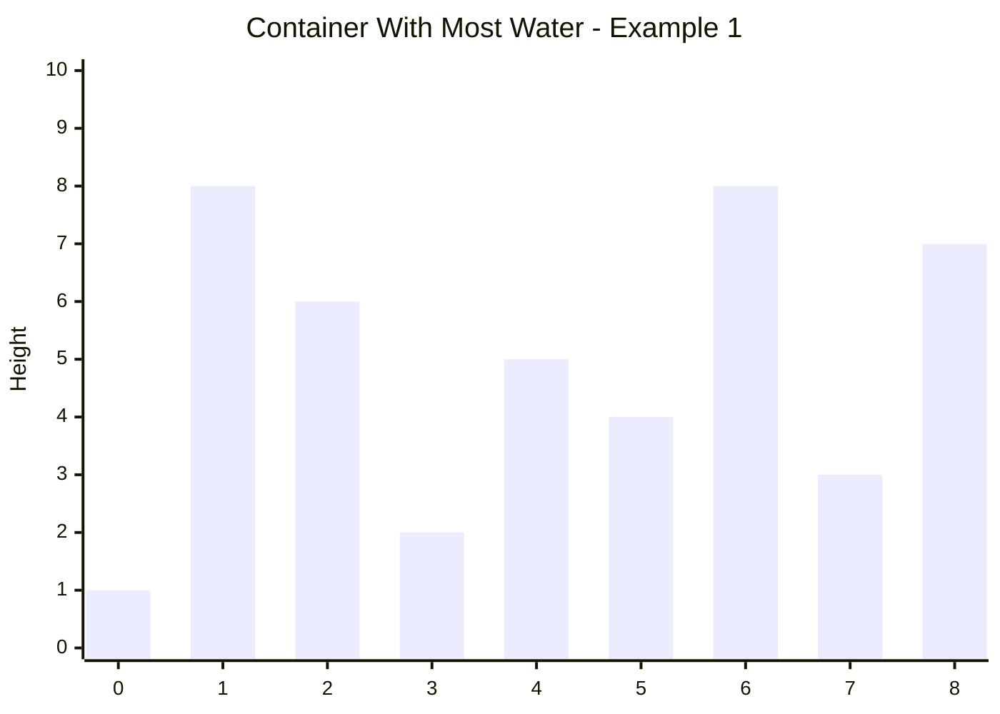

## Container With Most Water

You are given an integer array `height` of length `n`. There are `n` vertical lines drawn such that the two endpoints of the *i*th line are `(i, 0)` and `(i, height[i])`.

Find two lines that together with the x-axis form a container, such that the container contains the most water.

Return the maximum amount of water a container can store.

**Note:** You may not slant the container.

---

### Example 1



```
Input: height = [1,8,6,2,5,4,8,3,7]
Output: 49
Explanation: The above vertical lines are represented by array [1,8,6,2,5,4,8,3,7]. In this case, the max area of water (blue section) the container can contain is 49.
```

### Example 2

```
Input: height = [1,1]
Output: 1
```

---

### Constraints

- `n == height.length`
- `2 <= n <= 10^5`
- `0 <= height[i] <= 10^4`
